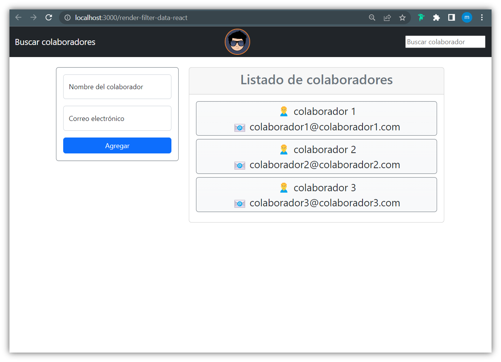

<p align="center">
  <a href="https://open.vscode.dev/enidev911/render-filter-data-react">
	  
  </a>
	&nbsp;&nbsp;&nbsp;
  <a href="https://enidev911.github.io/render-filter-data-react">
	  
  </a>

### INTRUCTIONS

Install project dependencies with: `npm install`

```json
"dependencies": {
  "@testing-library/jest-dom": "^5.16.5",
  "@testing-library/react": "^13.3.0",
  "@testing-library/user-event": "^13.5.0",
  "bootstrap": "^5.0.2",
  "react": "^18.2.0",
  "react-dom": "^18.2.0",
  "react-scripts": "5.0.1",
  "web-vitals": "^2.1.4"
},
```

Runs the app in the development mode with: `npm start`

Open [http://localhost:3000](http://localhost:3000) to view it in your browser.

---

### screenshot


